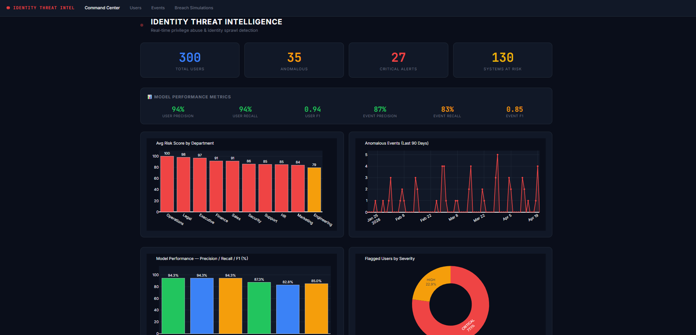

# Identity Sprawl & Privilege Abuse Detection

```
██╗██████╗ ███████╗███╗   ██╗████████╗██╗████████╗██╗   ██╗
██║██╔══██╗██╔════╝████╗  ██║╚══██╔══╝██║╚══██╔══╝╚██╗ ██╔╝
██║██║  ██║█████╗  ██╔██╗ ██║   ██║   ██║   ██║    ╚████╔╝
██║██║  ██║██╔══╝  ██║╚██╗██║   ██║   ██║   ██║     ╚██╔╝
██║██████╔╝███████╗██║ ╚████║   ██║   ██║   ██║      ██║
╚═╝╚═════╝ ╚══════╝╚═╝  ╚═══╝   ╚═╝   ╚═╝   ╚═╝      ╚═╝
THREAT INTELLIGENCE PLATFORM
```

## Architecture

```
┌─────────────────────────────────────────────────────────────┐
│                    DATA PIPELINE                             │
│                                                             │
│  sample_data/          generate_data.py                     │
│  ├── identity_users.csv  ──►  users_labels.csv              │
│  └── identity_events.csv ──►  events_labels.csv             │
│                                                             │
│                    DETECTION ENGINE                          │
│                                                             │
│  detector.py                                                │
│  ├── IsolationForest (users,  contamination=0.30)           │
│  ├── IsolationForest (events, contamination=0.41)           │
│  ├── Rule-based score boosts (stale admin, orphaned accts)  │
│  └── ──► flagged_users.csv + flagged_events.csv             │
│                                                             │
│                    LLM EXPLAINER                             │
│                                                             │
│  explainer.py                                               │
│  ├── Grok API (grok-3 via xAI)                              │
│  ├── Top 20 users + Top 20 events                           │
│  └── ──► explanations.json                                  │
│                                                             │
│                    SOC DASHBOARD                             │
│                                                             │
│  app.py (Flask)                                             │
│  ├── GET /            — Command Center                       │
│  ├── GET /users       — User Risk Table (filterable)         │
│  ├── GET /events      — Event Log (filterable)               │
│  ├── GET /user/<id>   — User Deep Dive + Blast Radius        │
│  ├── GET /simulate/<id> — Breach Simulation                  │
│  └── GET /api/live-feed — JSON (auto-refresh)               │
│                                                             │
│                    EVALUATION                                │
│                                                             │
│  evaluate.py ──► audit_report.md                            │
└─────────────────────────────────────────────────────────────┘
```

## Sreenshots 


Problem_01_Identity_Access/Problem_01_Identity_Access/Screenshots/command_center.png


## Quick Start

without GROG api key

```bash
# 1. Install dependencies
pip install -r requirements.txt

# 2. Generate ground-truth labels (run from identity_threat/ folder)
python generate_data.py

# 3. Run anomaly detection
python detector.py

# 4. (Optional) Generate LLM explanations — requires XAI_API_KEY
set XAI_API_KEY=your_key_here
python explainer.py

# 5. Launch dashboard
python app.py
# → Open http://localhost:5000

# 6. Evaluate results
python evaluate.py
```


## Key Results

| Metric    | Users | Events |
|-----------|-------|--------|
| Precision | TBD   | TBD    |
| Recall    | TBD   | TBD    |
| F1-Score  | TBD   | TBD    |

> Run `python evaluate.py` to fill in actual values.

## Detection Features

### User Features
- `days_inactive` — days since last login
- `privilege_encoded` — user/power-user/admin/superadmin ordinal
- `num_systems` — number of systems with access
- `is_contractor` / `is_new_hire` — contextual exceptions
- `has_admin_inactive` — admin account inactive >60 days ⚠
- `is_orphaned` — disabled account still with system access ⚠
- `is_overprivileged` — low role but high-value system access ⚠

### Event Features
- `hour_of_day`, `is_weekend`, `is_after_hours` — temporal signals
- `rowcount`, `is_bulk` (>10,000 rows) — volume signals
- `sensitivity_encoded` — low/medium/high resource sensitivity
- `is_external_dest` — data leaving to external destination
- `is_cross_dept` — access outside user's department
- `is_restricted_to_external` — high-sensitivity + external = CRITICAL
- `rowcount_zscore` — per-user statistical anomaly

## Compliance Frameworks

| Framework       | Requirement                              | Coverage                    |
|-----------------|------------------------------------------|-----------------------------|
| **NIST AC-2**   | Account Management                       | Stale & orphaned accounts   |
| **GDPR Art.32** | Technical security measures              | Data export monitoring      |
| **SOX 302**     | Internal controls over financial data    | Cross-dept GL/Finance access |

## Exception Handling
The system recognizes and suppresses false positives for:
- **CTO/CISO** — broad access by design (Executive + admin combination)
- **New hires** (<30 days) — unusual access patterns expected
- **Contractors** — short tenure is expected behavior
- **On-call IT** — after-hours access is legitimate

## Production Scale Strategy

```
Raw Events (millions/day)
         │
         ▼
    Apache Kafka
    (real-time stream)
         │
         ▼
    Spark Streaming
    (feature extraction + scoring)
         │
         ▼
    Redis (risk score cache, TTL=5min)
         │
         ▼
    Dashboard API (Flask / FastAPI)
         │
         ▼
    SIEM Integration (Splunk / Sentinel)
```

**Estimated throughput:** 100k users, 10M events/day at <200ms latency per score.

## File Structure

```
identity_threat/
├── generate_data.py     # Label generation from raw CSVs
├── detector.py          # IsolationForest anomaly detection
├── explainer.py         # Grok LLM risk assessments
├── app.py               # Flask SOC dashboard
├── evaluate.py          # Precision/recall evaluation
├── requirements.txt
└── README.md

sample_data/
├── identity_users.csv           # 300 user accounts
├── identity_events.csv          # 901 access events
├── identity_users_labels.csv    # Ground truth (generated)
├── identity_events_labels.csv   # Ground truth (generated)
├── flagged_users.csv            # Detector output
├── flagged_events.csv           # Detector output
└── explanations.json            # Grok LLM output
```
